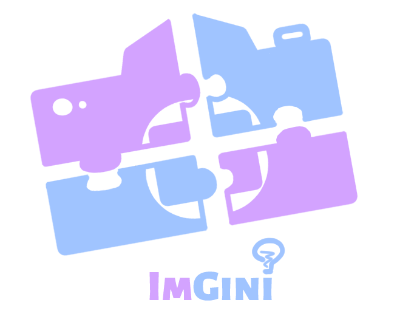

<!-- PROJECT LOGO -->

  

<h1 align="center">ImGini</h1>

<!-- ABOUT THE PROJECT -->
## About the Project

Ingini is a mobile app designed to be fun and interactive. The app consists on a guessing game with pictures, where you have to try writing the name of the image on display with a small handicap, the image starts hidden and reveals itself with each wrong guess until you guess the image or fail once its fully revealed.

With Ingini you can play the way you want since there are no fixed objectives:
* You can play the daily game once a day to keep icreasing your streak.
* Play the endless mode for something more casual and long.
* Compete with others on the rankings to see who has the longest streak.

Ingini also has a premium subscription for once every three months to help you mantain your streak and block adds. (The adds will be implemented in the near future for add revenue).

<!-- CONTACT -->
## Developer Team

|      Members      |             Contanct               |  Avatar  |
|-------------------|------------------------------------|----------|
|  Izan Navarro Lujan    |  iznalu@alumnatflorida.es    ||
|  Ausias Martinez Bernal   |  aumabe@alumnatflorida.es     ||
|  Javier Arellano Alvarez    |  jaaral@alumnatflorida.es  ||
|  Didac Arnau Nicola   |  diarni@alumnatflorida.es    ||

## Developed with

### The application has been developed with:

|        Key        |     Technology     |   Link   |
|-------------------|--------------------|----------|
|    Mobile App     |  React Native      ||
|    API        |  SpringBoot ||
|    Database       |  MongoDB  ||
|    Hosting        |  AWS               ||
|    HCM            |  FlexyGo           ||

<!-- GETTING STARTED -->
## Getting Started

### Solve some possible issues
We are having issues creating the apk for downloading the app. 
The code is completed, its just an Android Studio Issue

## Documentation

### Web API Documentation
 * [Web API](https://github.com/rsanzfloridauni/DAM2425_Groc/blob/DocumentationPI/Documentation/Web%20API%20%26%20BDD%20Imgini.pdf)
 * [JavaDoc](https://github.com/rsanzfloridauni/DAM2425_Groc/tree/main/API_REST/SpringbootPI/doc)

### PI Documentation
* [PI](https://github.com/rsanzfloridauni/DAM2425_Groc/blob/DocumentationPI/Documentation/Documentation%20Imgini.pdf)

### Mockup documentation
* [App overview](https://github.com/rsanzfloridauni/DAM2425_Groc/blob/DocumentationPI/Documentation/Web%20API%20%26%20BDD%20Imgini.pdf)

## Application Download

    

## Video Demo

  

## Elevator Pitch

  

